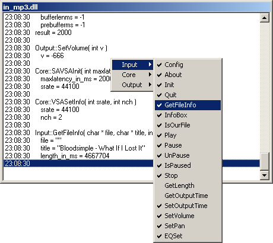

# in_bridge

## About

With the *Inbridge Winamp Plugin* (a.k.a. **in_bridge**)
you can monitor the communication between
another input plugin
and the Winamp host application.

To monitor `in_mp3.dll` for instance,
you would rename files like this:

- `in_mp3.dll` → `slave_in_mp3.dll`
- `in_bridge_unicode.dll` → `in_mp3.dll`

## History

### 2.4 (2006-08-26)

- in_char update for `GetFileInfo`'s title
- Encoding suffix added
- `Output::IsPlaying` logging now disabled by default

### 2.3 (2006-08-17)

- Added: Basic support for Unicode plugins
- Added: More error output
- Fixed: `Core::SAAdd` and `Core::VSAAdd` return value support
- Fixed: `hwndParent` value was not shown for `Input::InfoBox`
- Fixed: Cosmetic bug in EQSet

### 2.2 (2006-03-29)

### 2.1 (2006-02-02)

### 2.0 (2005-09-01)
